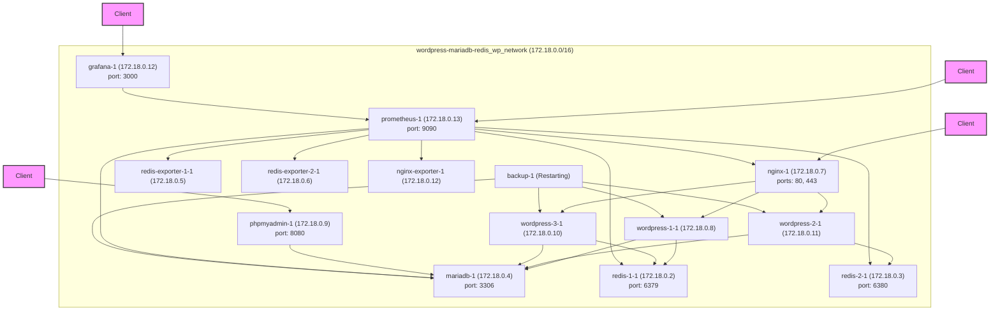
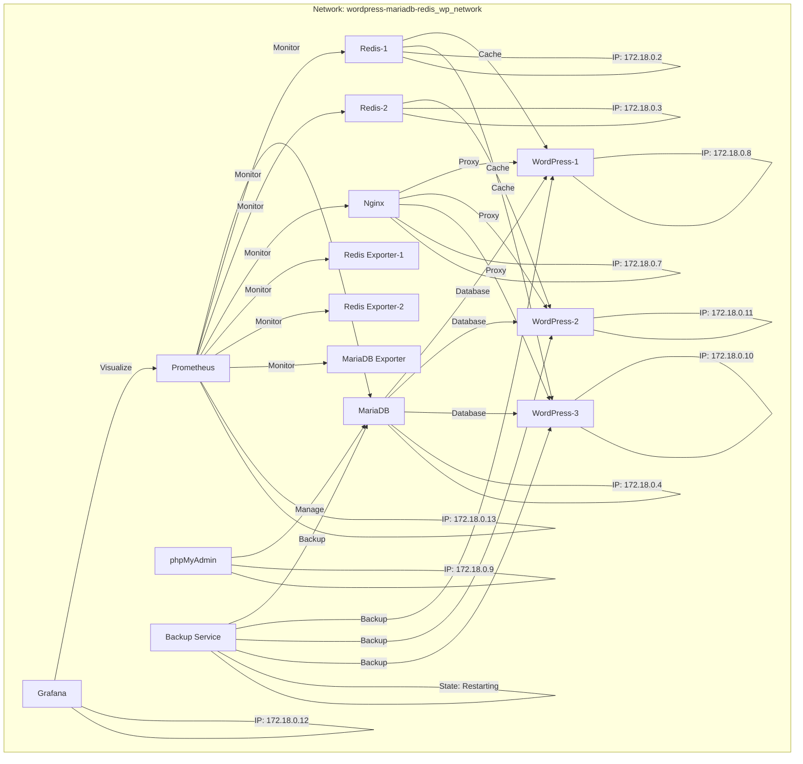

# System Architecture

## Overview

This project implements a high-performance WordPress setup with the following components:

- NGINX as reverse proxy and load balancer
- Multiple WordPress instances
- MariaDB as database
- Multiple Redis instances for object caching
- phpMyAdmin for database management
- Prometheus for monitoring
- Grafana for analytics and monitoring
- Backup service for automated data protection


## Network Topology

The following diagram illustrates the updated network configuration, container names, IP addresses, and service relationships within the Docker network:



The diagram shows:
- All services connected to the custom `wordpress-mariadb-redis_wp_network` (172.18.0.0/16).
- Updated container names and IP addresses reflect the current deployment.
- Redis and NGINX exporters are included for Prometheus monitoring.
- Service relationships and exposed ports are shown for clarity.

## Docker Compose Configuration

Below is the full configuration from the compose file:

```yaml
services:
  nginx:
    image: nginx:stable-alpine
    ports:
      - "80:80"
      - "443:443"
    volumes:
      - ./nginx/nginx.conf:/etc/nginx/nginx.conf:ro
      - ./nginx/default.conf:/etc/nginx/conf.d/default.conf:ro
    depends_on:
      - wordpress-1
      - wordpress-2
      - wordpress-3
    networks:
      - wp_network
  wordpress-1:
    build:
      context: .
      dockerfile: Dockerfile.wordpress
    # ports removed as NGINX handles external connections
    environment:
      - WORDPRESS_DB_HOST=mariadb
      - WORDPRESS_DB_USER=wordpress
      - WORDPRESS_DB_PASSWORD=wordpress
      - WORDPRESS_DB_NAME=wordpress
      - WORDPRESS_REDIS_HOST=redis-1
      - WORDPRESS_REDIS_PASSWORD=wordpress_redis
    depends_on:
      - mariadb
      - redis-1
    networks:
      - wp_network
  mariadb:
    image: mariadb:10
    environment:
      - MYSQL_ROOT_PASSWORD=wordpress
      - MYSQL_DATABASE=wordpress
      - MYSQL_USER=wordpress
      - MYSQL_PASSWORD=wordpress
    volumes:
      - db_data:/var/lib/mysql
    networks:
      - wp_network
  redis-1:
    image: redis:7.2-alpine
    restart: always
    command: ["redis-server", "--requirepass", "wordpress_redis"]
    ports:
      - "6379:6379"
    volumes:
      - redis_data_1:/data
    networks:
      - wp_network
  redis-2:
    image: redis:7.2-alpine
    restart: always
    command: ["redis-server", "--requirepass", "wordpress_redis"]
    ports:
      - "6380:6379"
    volumes:
      - redis_data_2:/data
    networks:
      - wp_network
  phpmyadmin:
    build:
      context: .
      dockerfile: Dockerfile.phpmyadmin
    ports:
      - "8080:80"
    environment:
      - PMA_HOST=mariadb
      - PMA_USER=wordpress
      - PMA_PASSWORD=wordpress
    depends_on:
      - mariadb
    networks:
      - wp_network
  prometheus:
    image: prom/prometheus
    ports:
      - "9090:9090"
    volumes:
      - ./prometheus/prometheus.yml:/etc/prometheus/prometheus.yml
    networks:
      - wp_network
  grafana:
    image: grafana/grafana
    ports:
      - "3000:3000"
    networks:
      - wp_network
  backup:
    build:
      context: .
      dockerfile: Dockerfile.backup
    volumes:
      - ./backups:/backups
    depends_on:
      - mariadb
      - wordpress-1
      - wordpress-2
      - wordpress-3
    networks:
      - wp_network
volumes:
  db_data:
  redis_data_1:
  redis_data_2:
  wordpress_uploads:
networks:
  wp_network:
    driver: bridge
```

## Local Development Configuration

This setup includes:

- **Networks**: A custom bridge network for services to communicate using service names
- **Volumes**: Named volumes for MariaDB and Redis data persistence
- **Restart Policy**: Automatic restart for all services if they fail
- **NGINX**: Reverse proxy and load balancer for WordPress
- **phpMyAdmin**: Database administration tool accessible via port 8080
- **Redis Cache**: Object caching for improved WordPress performance
- **Multi-stage builds**: Custom Dockerfiles that significantly reduce image sizes
- **Prometheus and Grafana**: Added for monitoring and analytics

## NGINX Reverse Proxy and Load Balancing

### Reverse Proxy Benefits

- **Security Enhancement**: NGINX acts as a barrier between users and your WordPress application
- **SSL/TLS Termination**: NGINX handles HTTPS encryption/decryption
- **Static Asset Caching**: Improves performance by caching static files
- **Compression**: Reduces bandwidth usage with gzip compression
- **Protection Against Common Attacks**: Better security against DDoS and other attacks

### Load Balancing Features

- **Multiple WordPress Instances**: Three WordPress instances provide horizontal scaling out of the box
- **Redis Distribution**: WordPress instances 1 and 3 connect to redis-1, while instance 2 connects to redis-2
- **Session Persistence**: IP hash ensures users maintain their sessions even with multiple WordPress instances
- **Health Checks**: Automatically redirects traffic from unhealthy instances
- **Equal Distribution**: Distributes incoming requests across all three WordPress instances

## WordPress and Redis Integration

The WordPress containers are configured to use Redis for object caching, which significantly improves performance by:

- Reducing database load
- Speeding up page loads
- Improving concurrency
- Centralizing session management

Typical performance improvements include:
- 2-5x faster page loads for authenticated users
- 20-40% reduction in server resource usage
- Significantly improved handling of high-traffic situations

## Monitoring with Prometheus and Grafana

Prometheus and Grafana are integrated for monitoring and analytics:

- **Prometheus**: Collects and stores metrics from all services
- **Grafana**: Provides a web interface for visualizing metrics and monitoring system performance

Prometheus is configured to scrape metrics from:

- NGINX
- MariaDB
- Redis instances

Grafana is used to create dashboards and alerts based on Prometheus metrics.

## Future Enhancements

- **Implement Content Delivery Network (CDN)**: Add CloudFront or another CDN for further performance improvements
- **Extend Monitoring**: Add additional metrics and alerts to the existing Prometheus/Grafana setup
- **High Availability**: Implement multi-region deployment for disaster recovery

## Updated Network Visualization

Here's an alternative view of the network topology:


