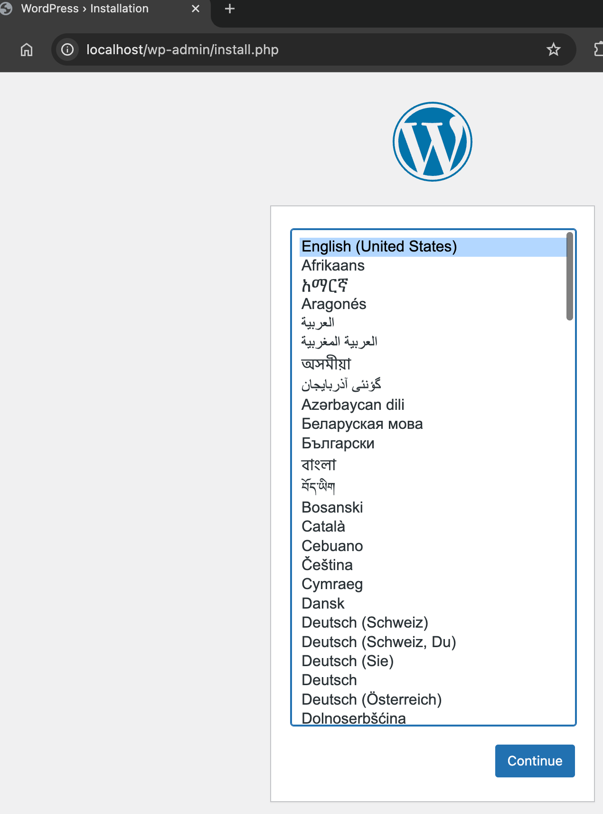

# WordPress with MariaDB

This example defines one of the basic setups for WordPress with MariaDB as the database. More details on how this works can be found on the official [WordPress image page](https://hub.docker.com/_/wordpress).


Project structure:
```
.
├── compose.yaml
└── README.md
```

[_compose.yaml_](compose.yaml)
```yaml
services:
  db:
    # Switching to MariaDB which supports arm64 architecture and is compatible with WordPress
    image: mariadb:10.9
    volumes:
      - db_data:/var/lib/mysql
    restart: always
    environment:
      - MYSQL_ROOT_PASSWORD=wordpress
      - MYSQL_DATABASE=wordpress
      - MYSQL_USER=wordpress
      - MYSQL_PASSWORD=wordpress
    ...
  wordpress:
    image: wordpress:6.4-php8.1-apache
    ports:
      - 80:80
    restart: always
    ...
```

When deploying this setup, docker compose maps the WordPress container port 80 to
port 80 of the host as specified in the compose file.

> ℹ️ **_INFO_**  
> For compatibility purpose between `AMD64` and `ARM64` architecture, we use MariaDB as database.  
> MariaDB 10.9 is compatible with both architectures and works well with WordPress as of 17 May 2025.  
> Note: WordPress does not natively support PostgreSQL but is fully compatible with MySQL/MariaDB, which is why MariaDB was chosen as the database solution.

## Local Development Configuration

For local development, we provide an alternative configuration file (`docker-compose.yml`) that includes:

1. WordPress (latest version)
2. MariaDB (latest version) 
3. phpMyAdmin for database management

[_docker-compose.yml_](docker-compose.yml)
```yaml
services:
  wordpress:
    image: wordpress:latest
    ports:
      - "80:80"
    environment:
      - WORDPRESS_DB_HOST=mariadb
      # ...
  
  mariadb:
    image: mariadb:latest
    environment:
      - MYSQL_ROOT_PASSWORD=wordpress
      # ...
    volumes:
      - db_data:/var/lib/mysql
  
  phpmyadmin:
    image: phpmyadmin:latest
    ports:
      - "8080:80"
    environment:
      - PMA_HOST=mariadb
      # ...
```

### Additional Configuration

The local development setup includes:

- **Networks**: A custom bridge network for services to communicate using service names
- **Volumes**: Named volume for MariaDB data persistence
- **Restart Policy**: Automatic restart for all services if they fail
- **phpMyAdmin**: Database administration tool accessible via port 8080

## Deploy Options

### Standard Deployment

```bash
docker compose up -d
```

### Local Development Deployment

```bash
docker compose -f docker-compose.yml up -d
```

Example output for standard deployment:

```console
[+] Running 37/37
 ✔ wordpress Pulled                                                                                                      68.5s 
   ✔ d9b17d6e3565 Pull complete                                                                                           0.6s 
  ...
[+] Running 4/4
 ✔ Network wordpress-mariadb_default        Created                                                                      0.0s 
 ✔ Volume "wordpress-mariadb_db_data"       Created                                                                      0.0s 
 ✔ Container wordpress-mariadb-wordpress-1  Started                                                                      0.6s 
 ✔ Container wordpress-mariadb-db-1         Started                                                                      0.6s 
```


## Expected result

Check containers are running and the port mapping:

```bash
docker ps
```

Example output:

```console
CONTAINER ID   IMAGE                         COMMAND                  CREATED          STATUS          PORTS                NAMES
d4feb59bab20   wordpress:6.4-php8.1-apache   "docker-entrypoint.s…"   47 seconds ago   Up 46 seconds   0.0.0.0:80->80/tcp   wordpress-mariadb-wordpress-1
0ff2639f74ca   mariadb:10.9                  "docker-entrypoint.s…"   47 seconds ago   Up 46 seconds   3306/tcp             wordpress-mariadb-db-1
```

### Accessing Services

#### WordPress

Navigate to `http://localhost:80` in your web browser to access WordPress.



#### phpMyAdmin (Local Development Setup)

If you're using the local development setup, navigate to `http://localhost:8080` to access phpMyAdmin:

- **Server**: mariadb
- **Username**: wordpress
- **Password**: wordpress

phpMyAdmin provides a web interface for:

- Managing database tables and records
- Importing and exporting data
- Running SQL queries
- Monitoring database performance

### Stopping Services

#### Standard Setup

```bash
docker compose down
```

#### Local Development Setup

```bash
docker compose -f docker-compose.yml down
```

To remove all WordPress data, delete the named volumes by passing the `-v` parameter:

```bash
# For standard setup
docker compose down -v

# For local development setup
docker compose -f docker-compose.yml down -v
```

## Troubleshooting

### Common Issues

#### Database Connection Error

If WordPress cannot connect to the database:

1. Check that the MariaDB container is running
2. Verify the environment variables in both containers match
3. Try restarting both services

#### phpMyAdmin Connection Issues

If you cannot access phpMyAdmin or it cannot connect to MariaDB:

1. Ensure the `mariadb` service is running
2. Check that port 8080 is not being used by another application
3. Verify the environment variables match those used by MariaDB

#### Persistence Issues

If your data disappears after restarts:

1. Make sure you're not using `down -v` which removes volumes
2. Check that volumes are properly configured in your docker-compose file

## Additional Information

### Security Note

The configuration provided is intended for local development only. For production environments:

- Use strong, unique passwords
- Consider using Docker secrets for sensitive information
- Implement proper network segmentation
- Enable SSL/TLS for secure connections

### Extending the Setup

This basic setup can be extended with additional services:

- Redis for caching
- NGINX as a reverse proxy
- MailHog for email testing

### License

This project is distributed under the MIT License. See the [LICENSE](LICENSE) file for details.
